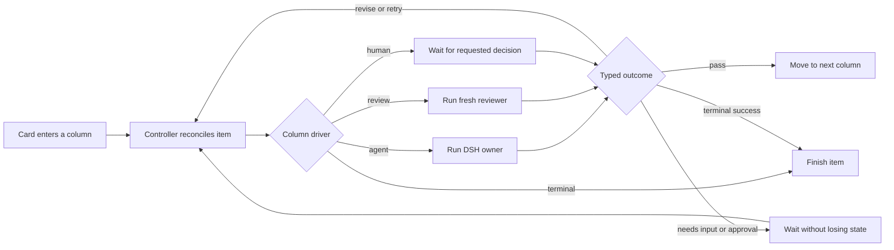

# Autonomous processes v2: DSH work on dynamic Kanban boards

> **Superseded:** Do not implement the reconciler described here. The replacement
> is [Autonomous processes v3: Temporal orchestration with DSH execution](../../bees-server/docs/autonomous-processes-temporal-v3.md).
> V2 remains as decision history showing the custom machinery Temporal replaces.

## Decision

Build one reusable **process controller**, not a controller specifically for
Goals.

The controller owns durable work state and automatically moves cards. DSH owns
planning, tool use, multi-round execution, todos, subagents, and workflows. A
process definition says what each Kanban column means and what should happen
when work enters it.

Goals is the first packaged process built on this controller. It is not a
special runtime.

The boundary is important:

| Component | Owns |
|---|---|
| Bees process controller | Current column, stage attempts, transitions, waits, review routing, recovery, audit |
| DSH owner agent | Planning and completing the current stage |
| DSH todos | The owner's visible subtask plan |
| DSH subagents/workflows | Independent bounded work delegated by the owner |
| DSH approval | Permission for protected tool actions |
| Reviewer agent | Independent, structured evaluation of a completion candidate |
| Human | Missing decisions, protected approvals, and reviews required by the prompt or policy |
| Kanban board | A projection of the controller's durable state, not a second source of truth |

Do not build another task scheduler, child-card protocol, or agent loop inside
Bees. The controller coordinates DSH; it does not replace it.

## Product rule

For an automated process, normal card movement is never a human task.

- Creating an item starts it automatically unless it is explicitly saved as a
  draft.
- Entering an automated column starts its configured handler.
- A successful handler advances the card.
- A reviewer rejection sends the card back for another attempt.
- A question or approval puts the card in a visible waiting state.
- An answer resumes work automatically.
- A terminal success puts the card in `Done`.
- Restarting Bees resumes previously active work from durable checkpoints.

The UI may offer `Pause`, `Resume`, `Retry`, and `Cancel`. It must hide drag,
left-arrow, and right-arrow movement for controller-owned items. An admin-only
override can exist for repair, but it must require a reason and write an audit
event.

## Mental model

Every process is a dynamic Kanban board. Every column is a **work state**.
Every card is a **process instance**.



The controller is event driven. It performs at most one durable action in a
reconciliation tick, records an idempotency receipt, and reconciles again. It
does not poll or spin while nothing has changed.

## Column definition

Keep the first controller version linear. The existing stage position defines
the default success transition to the next column. This covers Goals and most
operational processes without introducing a workflow language.

Add one `automation_json` field to each stage with this versioned shape:

```json
{
  "version": 1,
  "driver": "agent",
  "start": "automatic",
  "assignmentId": "goal-owner-assignment-id",
  "instructions": "Produce and verify the requested deliverable.",
  "maxAttempts": 4,
  "onSuccess": "next",
  "onFailure": "wait"
}
```

A review column uses the same shape with `driver: "review"`, plus
`onPass: "next"`, `onRevise: "previous"`, `maxCycles`, and `humanReview`.
Omit the review column when a process does not need independent review.

Supported `driver` values in v2:

| Driver | Behavior on entry |
|---|---|
| `queue` | Holds a draft or intentionally queued item; does not run |
| `agent` | Starts or resumes a DSH stage owner automatically |
| `review` | Starts a fresh reviewer with a structured verdict contract |
| `human` | Creates an explicit human decision requested by this process definition |
| `terminal` | Marks the process instance complete; runs nothing |

Supported policies:

- `start`: `automatic` or `manual`. Packaged Bees processes default to
  `automatic`; `manual` is useful for drafts and user-authored human workflows.
- `onSuccess`: initially only `next` or `complete`.
- `onFailure`: `retry` or `wait`.
- `maxAttempts`: maximum infrastructure or handler attempts before asking for
  intervention.
- `onPass` and `onRevise`: review-column transitions; initially `next` and
  `previous`.
- `humanReview`: `never`, `prompt-or-policy`, or `always` on a review column.

Defer conditional graphs, arbitrary expressions, and model-written transition
rules. Add named branches only when a real process cannot be represented by
ordered columns.

## Card state versus column

`work_items.stage_id` remains the board column. Add a separate controller
status for activity within that column:

```text
ready | running | reviewing | waiting | paused | failed | completed
```

This avoids adding `Waiting` and `Review` columns to every business process.
For example, a card can remain in `Draft` with a `Waiting for approval` badge,
or remain in `Review` with an `AI review` badge.

The board should show:

- the current column;
- the controller status;
- the active agent or reviewer;
- completed and total DSH todos;
- the current attempt and review cycle;
- the precise waiting reason, if any; and
- the next automatic action.

A workspace-level **Needs you** view collects all cards whose controller status
is `waiting` for human input, approval, or requested review. Humans should not
scan every board to discover requests.

## Generic controller state

Add one row per controlled card:

```sql
CREATE TABLE process_controller_state (
  work_item_id TEXT PRIMARY KEY REFERENCES work_items(id) ON DELETE CASCADE,
  stage_id TEXT NOT NULL REFERENCES stages(id),
  status TEXT NOT NULL,
  attempt INTEGER NOT NULL DEFAULT 0,
  review_cycle INTEGER NOT NULL DEFAULT 0,
  current_execution_id TEXT,
  current_review_execution_id TEXT,
  pending_interaction_json TEXT,
  last_receipt_key TEXT,
  paused_at TEXT,
  updated_at TEXT NOT NULL
) STRICT;
```

Extend `execution_links` with enough correlation to explain every run:

```text
stage_id
purpose            worker | reviewer
attempt
review_cycle
```

Reuse the existing:

- `bees_run_checkpoints` for DSH run recovery;
- `bees_domain_receipts` for idempotent controller commands;
- `dsh_audit_events` for operator-visible history; and
- DSH session logs for goal, todo, tool, approval, and subagent state.

Do not copy full DSH transcripts, todo lists, or goal snapshots into the new
controller row. They already have a durable owner. Bees stores correlation and
the cross-session process state only.

## The reconciliation reducer

Implement one generic function:

```text
reconcile(workItemId, cause, idempotencyKey)
```

It loads the item, current stage, stage automation, controller state, active
execution, and pending interaction. It then chooses exactly one command:

1. If the process or card is archived, do nothing.
2. If paused, do nothing.
3. If a human interaction is pending, set `waiting` and do nothing.
4. If an execution is active, project its status and do nothing.
5. If a worker submitted a valid completion candidate, advance to the next
   column.
6. If the reviewer returned `revise`, move to the configured prior work column
   and start the next worker attempt with the feedback.
7. If the reviewer returned `pass`, advance to the next column.
8. If the current column is `agent`, start its worker.
9. If it is `review`, start its reviewer.
10. If it is `human`, create its explicit decision request.
11. If it is `terminal`, set `completed`.

Apply the chosen command and its receipt in one SQLite transaction whenever the
command only changes Bees state. For DSH startup, reserve the receipt and run
identity first, start DSH, then acknowledge or recover the reservation. The
existing execution admission and checkpoint pattern should remain the
idempotency boundary.

Trigger reconciliation after:

- item creation;
- automatic stage entry;
- DSH run settlement;
- a stage-result tool call;
- reviewer settlement;
- approval asked or decided;
- human input submitted;
- retry, resume, or cancel;
- a schedule occurrence; and
- application startup recovery.

## Generic DSH stage contract

Register controller tools in every worker run instead of embedding a
Goals-specific completion protocol in prompts.

### `bees_report_progress`

Records a short status and optional evidence references. It never changes the
column by itself.

### `bees_request_input`

Accepts a concrete question, why the answer is required, and optional choices.
It checkpoints a durable interaction, disarms autonomous continuation, and
settles the current turn. The UI answer becomes a sourced continuation in the
same execution, clears the interaction, and triggers reconciliation.

Use this only when the answer cannot be discovered safely. Ordinary planning,
subtask creation, and uncertainty are not reasons to ask a human.

### `bees_submit_stage_result`

Accepts a typed completion candidate:

```json
{
  "outcome": "candidate",
  "summary": "What changed and why it is complete",
  "criteria": [
    {
      "criterion": "Observable requirement",
      "status": "pass",
      "evidence": ["outputs/report.md", "test: npm test"]
    }
  ],
  "outputs": ["outputs/report.md"],
  "risks": []
}
```

Calling it does not move the card directly or mark the DSH goal complete. The
controller validates the candidate, advances to the next configured column,
and starts that column's handler. A following `review` column therefore becomes
visible on the board and begins automatically.

Keep `bees_publish_outputs` as the generic protected publication tool. Its DSH
approval remains separate from review of correctness.

## DSH execution inside an agent column

On entry to an `agent` column, the controller:

1. Creates a run workspace and stages the attached inputs.
2. Creates the DSH owner using the configured assignment.
3. Applies the `ask` approval policy.
4. Registers the generic Bees controller tools.
5. Creates the DSH goal directly through `ctx.goals.create()` when the stage is
   configured for multi-round work.
6. Supplies the stage instructions, acceptance criteria, prior attempt
   feedback, and remaining budgets.
7. Arms the DSH goal-round driver.
8. Projects `todo/write`, subagent, workflow, approval, and run events into the
   card details.

The DSH owner must automatically:

- create and maintain its todo list;
- use plain subagents for one or two independent tasks;
- use a workflow for a larger explicitly configured orchestration;
- keep doing useful work across DSH goal rounds;
- verify child results before using them;
- request only genuinely missing human input;
- submit a typed completion candidate; and
- stay within configured round, attempt, token, time, and side-effect budgets.

The controller, not the model, calls `ctx.goals.complete()` after review passes.
Prevent the owner from bypassing this by applying an agent-scoped tool
restriction that denies `create_goal` and `update_goal`, then register the Bees
tools in the agent's own scope. Keep `get_goal` so the owner can see host-owned
state. Add a monotonic tool guard as defense in depth; DSH tool restrictions are
composition controls, not a standalone security boundary.

On application restart, DSH goal activation is intentionally disarmed. Startup
recovery must call `ctx.goals.resume()` only for controller rows that were
durably `running`. It must not resume paused or human-waiting cards.

## Automatic review loop

Every automatic review uses a fresh DSH agent or one-shot subagent. It receives:

- the stage objective and acceptance criteria;
- the worker's structured candidate;
- a read-only snapshot of outputs;
- relevant verification logs and source references; and
- prior reviewer feedback for the current cycle.

It does not receive the worker's reasoning transcript. This keeps the review
independent.

The reviewer has a narrow tool allow-list, no publication tool, approval policy
`reject`, and a structured output contract:

```json
{
  "verdict": "pass",
  "criteria": [
    {
      "criterion": "Observable requirement",
      "status": "pass",
      "evidenceChecked": ["outputs/report.md"]
    }
  ],
  "feedback": [],
  "humanReason": null
}
```

Allowed verdicts:

- `pass`: advance automatically unless a human review gate applies;
- `revise`: return feedback to the owner and run another attempt;
- `needs_human`: create one precise human request; and
- `invalid`: treat as a reviewer failure and retry within the attempt budget.

After `revise`, the controller moves the card to the configured prior work
column, appends the feedback to the same owner session when recovery is safe,
resumes its DSH goal, and returns the card to `running`. If a fresh session is
required, it stages the prior outputs and feedback as inputs and records the
replacement link.

Set finite defaults, for example 12 goal rounds, 4 stage attempts, and 4 review
cycles. Reaching a cap moves the controller to `waiting` with one diagnostic and
recommended choices. It never reports success merely because a budget ended.

## Human interaction policy

Default packaged-process policy:

```text
planning                 automatic
subtask creation         automatic
subagent creation        automatic
status movement          automatic
internal review          automatic
revision after review    automatic
human final review       prompt-or-policy
protected side effect    DSH approval
missing business choice  ask human
```

The controller may wait for a human only when at least one is true:

1. Required information or a business decision cannot be discovered safely.
2. DSH policy requires approval for a protected action.
3. The user's prompt explicitly requests review or confirmation.
4. Workspace policy requires a human gate for this stage or effect.
5. The independent reviewer returns `needs_human` with a concrete reason.
6. Retry or review budgets are exhausted.

An approval denial is not automatically a blocker. The result returns to the
owner, which should choose a safe alternative. Wait for the human only when no
permitted path can satisfy the stage.

## Board behavior

For processes with `controller_mode = automatic`:

- remove manual move arrows from `ItemCard`;
- do not implement drag-to-move;
- show controller status and next action;
- show a live DSH todo checklist;
- show child-agent and reviewer activity;
- open the pending question, approval, or review from the card;
- provide output content preview before a human review or publication decision;
- provide `Pause`, `Resume`, `Retry`, and `Cancel`; and
- provide an audited admin repair action outside the normal board controls.

For `controller_mode = manual`, preserve today's generic Kanban behavior. This
allows user-created boards that intentionally track human work while packaged
Bees processes default to autonomy.

## Configure Goals on the generic controller

After the controller exists, seed Goals as an ordinary automatic process:

| Column | Driver | Configuration |
|---|---|---|
| `Ready` | `queue` | New drafts wait; `Create and run` immediately advances |
| `Work` | `agent` | Goal owner, DSH goal rounds, todos and delegation; a candidate advances |
| `Review` | `review` | Fresh reviewer; pass advances, revise returns to `Work` automatically |
| `Done` | `terminal` | Terminal success |

`Waiting for you` is a controller badge and Needs-you entry, not a mandatory
Goals column. This lets a question pause `Work` or a requested final review
pause `Review` without changing the business stage.

Recommended Goals defaults:

```json
{
  "controllerMode": "automatic",
  "startPolicy": "automatic",
  "maxGoalRounds": 12,
  "maxStageAttempts": 4,
  "maxReviewCycles": 4,
  "humanReview": "prompt-or-policy",
  "publication": "approval-required"
}
```

A user then configures a goal by providing only:

1. Objective.
2. Observable acceptance criteria.
3. Inputs and output destinations.
4. Constraints and protected actions.
5. Whether the prompt requires human review.
6. Optional budget overrides.

They do not configure child cards, move statuses, select reviewer turns, or
restart revision loops.

## Smallest implementation sequence

### 1. Add controller metadata and state

- Add `controller_mode` to `processes`.
- Add versioned `automation_json` to `stages`.
- Add `process_controller_state`.
- Add stage, purpose, attempt, and review-cycle correlation to
  `execution_links`.
- Seed existing non-Goals processes as `manual` and Goals v2 as `automatic`.

Primary file: `dsh-runtime/plugin/lib/product.js`.

### 2. Add the idempotent reconciler

- Create `process-controller.js` rather than growing `product.js`.
- Implement one-action-per-tick reconciliation.
- Reuse `bees_domain_receipts`, run admission, and audit helpers.
- Reconcile automatic items at startup.

Wire it from `dsh-runtime/plugin/lib/index.js` and the existing process/runtime
commands.

### 3. Make stage runs generic

- Pass stage automation and purpose through immutable run `initialData`.
- Register `bees_report_progress`, `bees_request_input`, and
  `bees_submit_stage_result` in `AgentRuntime.setup()`.
- Let the controller create/resume/complete DSH goals through `ctx.goals`.
- Keep approval checkpointing and output publication unchanged.

Primary file: `dsh-runtime/plugin/lib/agent-runtime.js`.

### 4. Add automatic review

- Start a fresh, read-restricted reviewer run from a completion candidate.
- Require the structured verdict.
- Route `pass`, `revise`, and `needs_human` through the same reconciler.
- Enforce attempt and review-cycle caps.

Do not create a separate reviewer queue or reviewer-specific controller.

### 5. Make the board a projection

- Remove move controls for automatic processes.
- Render controller status, todos, agents, attempts, pending interaction, and
  next action.
- Add the Needs-you view and content preview.
- Keep manual controls for manual processes.

Primary file: `dsh-runtime/plugin/lib/client.js`.

### 6. Connect schedules and recovery

- A schedule creates or wakes a process instance, then calls `reconcile`.
- A recurring template creates a new occurrence item and session rather than
  rerunning a completed card.
- Startup resumes only controller-owned active work.
- Recovery preserves unresolved approvals and input requests without repeating
  external side effects.

Primary files: `dsh-runtime/plugin/lib/process-runtime.js` and
`dsh-runtime/plugin/lib/agent-runtime.js`.

## Acceptance tests

The controller is ready only when these pass:

- Creating an automatic Goals item moves `Ready → Work` without a manual click.
- The owner creates todos and delegates independent work automatically.
- Reviewer `revise` causes another owner attempt without human intervention.
- Reviewer `pass` moves `Review → Done` automatically.
- A prompt-required human review waits and resumes after accept or feedback.
- An approval request appears in Needs you; allowing or denying it resumes the
  controller without manual movement.
- Denial lets the owner attempt a safe alternative before asking for help.
- Restart during work resumes from the last durable checkpoint once.
- Restart during approval or input does not duplicate the protected action.
- Review and attempt caps produce an honest waiting state, never false `Done`.
- Two identical events cannot start two workers, reviewers, or publications.
- An automatic card cannot be moved with normal board controls.
- A manual process still supports manual Kanban movement.
- A scheduled occurrence runs through review to terminal state autonomously.

## Deferred until justified

Do not put these in the first reusable controller:

- arbitrary DAG or expression language;
- model-authored transition destinations;
- shared cross-card todo graphs;
- a new child-card orchestration engine;
- distributed multi-host leases;
- custom reviewer controller types;
- copying full DSH state into Bees tables; or
- silent unlimited retries.

Add a feature only when a concrete process cannot be expressed as ordered work
states plus typed handler outcomes. That keeps the controller reusable and
small while DSH remains the engine doing the actual work.

## Relevant implementation references

- Product schema, process and stage seeds, work items, and commands:
  [`dsh-runtime/plugin/lib/product.js`](../dsh-runtime/plugin/lib/product.js)
- DSH sessions, scoped tools, approvals, checkpoints, recovery, and outputs:
  [`dsh-runtime/plugin/lib/agent-runtime.js`](../dsh-runtime/plugin/lib/agent-runtime.js)
- Existing process commands, receipts, and schedules:
  [`dsh-runtime/plugin/lib/process-runtime.js`](../dsh-runtime/plugin/lib/process-runtime.js)
- Current board controls and run presentation:
  [`dsh-runtime/plugin/lib/client.js`](../dsh-runtime/plugin/lib/client.js)
- DSH composition and injected services:
  [`dsh-runtime/profile/cordis.patch.yml`](../dsh-runtime/profile/cordis.patch.yml)
